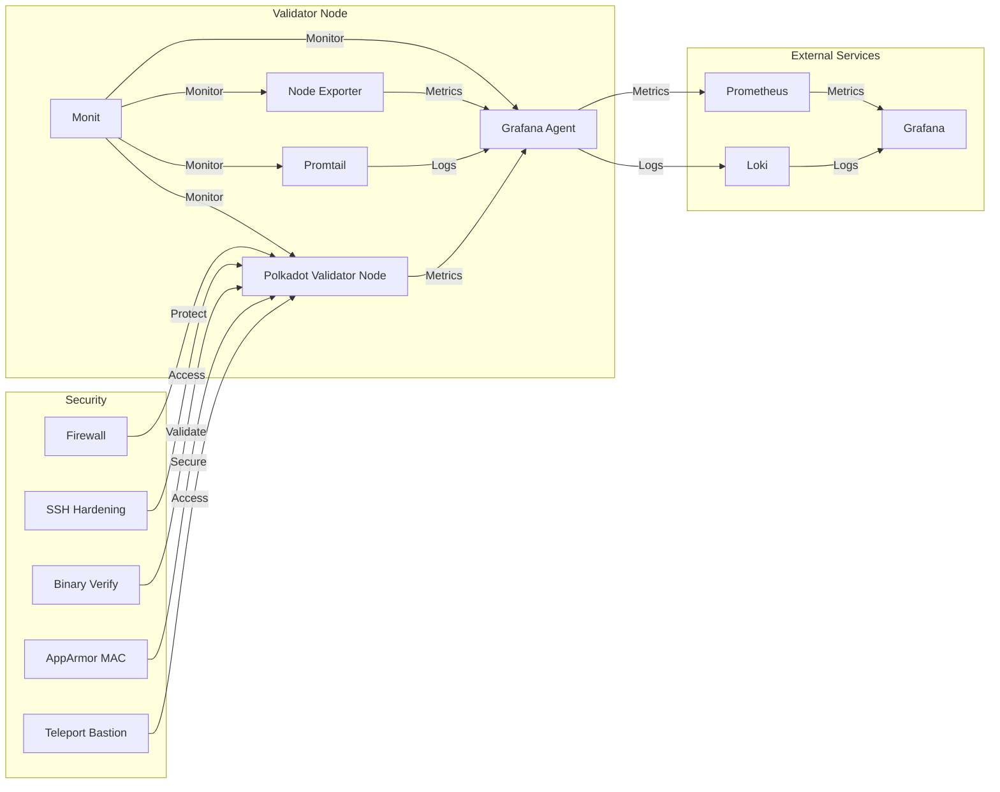
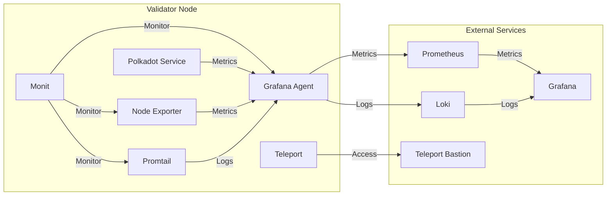

# Polkadot Validator Infrastructure Deployment

## Overview

This Ansible collection provides a comprehensive, secure, and automated solution for deploying and managing Polkadot validator nodes. Designed with a focus on security, observability, and reliability, the collection offers robust infrastructure-as-code capabilities.

## New Features

### Sync Type Validation
- Restricted sync types to 'warp', 'fast', and 'full'
- Validation added to ensure correct sync type usage

### Upgrade and Rollback Mechanism
- Comprehensive upgrade tasks with rollback strategy
- Backup and restore capabilities with notification system

### Monitoring and Backup Infrastructure
- Resource monitoring moved to admin role
- Flexible monitoring script with Slack and email notifications
- Integration with Grafana Agent for metrics

## Architecture



## Services Interaction



## Security and Hardening Features

### System Hardening
- **Shared Memory Protection**
  - Secure mounting of `/dev/shm`
  - Prevents code execution, setuid, and device access
  - Configurable mount options

- **Fail2ban SSH Protection**
  - Configurable brute-force attack mitigation
  - Customizable ban times and retry attempts
  - Multi-service support (SSH)

- **AppArmor Service Protection**
  - Mandatory Access Control (MAC) for all services
  - Fine-grained resource access control
  - Enforced security profiles
  - Protection against privilege escalation
  - Network and file system access restrictions

### Monitoring and Alerting
- Comprehensive system monitoring
- Centralized log management
- Proactive alerting
- **OpsGenie Heartbeats**
  - Configurable service health monitoring
  - Multiple heartbeat endpoints
  - Flexible interval settings

## Dynamic Inventory Configuration

This project supports dynamic inventory for both AWS and DigitalOcean cloud providers.

### Prerequisites

1. Install required collections:
```bash
ansible-galaxy collection install -r requirements.yml
```

2. Configure cloud provider credentials:

For AWS, set the following environment variables:
```bash
export AWS_ACCESS_KEY_ID='your_aws_access_key'
export AWS_SECRET_ACCESS_KEY='your_aws_secret_key'
```

For DigitalOcean, set the API token:
```bash
export DO_API_TOKEN='your_digitalocean_api_token'
```

### Usage

To list all hosts from a specific provider:

```bash
# List AWS hosts
ansible-inventory -i inventory/aws_ec2.yml --list

# List DigitalOcean hosts
ansible-inventory -i inventory/digitalocean.yml --list
```

To use both providers in a playbook:

```bash
ansible-playbook -i inventory/aws_ec2.yml -i inventory/digitalocean.yml playbook.yaml
```

## Bare Metal Inventory

The project supports multiple ways to manage bare metal hosts:

1. **Static YAML Inventory**
   - Define hosts in YAML files under `inventory/hosts/`
   - Supports grouping and custom variables
   - Example provided in `inventory/hosts/bare_metal_example.yml`

2. **Netbox Integration**
   - Automatically discover hosts from Netbox DCIM
   - Groups hosts by device roles, sites, and racks
   - Configure with environment variables:
   ```bash
   export NETBOX_URL='https://netbox.example.com'
   export NETBOX_TOKEN='your_netbox_api_token'
   ```

3. **Proxmox Integration**
   - Discover hosts from Proxmox clusters
   - Includes both VMs and containers
   - Configure with environment variables:
   ```bash
   export PROXMOX_URL='https://proxmox.example.com:8006'
   export PROXMOX_USER='root@pam'
   export PROXMOX_PASSWORD='your_proxmox_password'
   ```

To use bare metal inventory:

```bash
# List all bare metal hosts
ansible-inventory -i inventory/bare_metal.yml --list

# Use with specific groups
ansible-playbook -i inventory/bare_metal.yml playbook.yaml --limit validators

# Combine with cloud providers
ansible-playbook -i inventory/aws_ec2.yml -i inventory/digitalocean.yml -i inventory/bare_metal.yml playbook.yaml
```

## Secure Credential Management with Ansible Vault

This project uses Ansible Vault to securely manage sensitive credentials and API keys. All sensitive data is stored in encrypted vault files and never committed to version control.

### Initial Setup

1. Create your vault password file:
```bash
echo "your-secure-password" > .vault_pass
chmod 600 .vault_pass
```

2. Copy the vault template and create your encrypted vault:
```bash
# Copy the template
cp group_vars/all/vault.yml.example group_vars/all/vault.yml

# Encrypt the vault file
ansible-vault encrypt group_vars/all/vault.yml --vault-password-file .vault_pass
```

3. Edit the vault to add your credentials:
```bash
# Edit the vault
ansible-vault edit group_vars/all/vault.yml --vault-password-file .vault_pass
```

### Vault Structure

The vault file (`group_vars/all/vault.yml`) contains all sensitive credentials:

```yaml
# Cloud Provider Credentials
aws_access_key: your_aws_access_key
aws_secret_key: your_aws_secret_key
do_api_token: your_digitalocean_token

# Infrastructure Management
netbox_url: https://netbox.example.com
netbox_token: your_netbox_token
proxmox_url: https://proxmox.example.com:8006
proxmox_user: root@pam
proxmox_password: your_proxmox_password

# Monitoring and Alerts
opsgenie_api_key: your_opsgenie_api_key
opsgenie_heartbeat_name: validator-heartbeat
grafana_api_key: your_grafana_api_key
```

### Using Vault with Playbooks

1. Run playbooks with vault password:
```bash
ansible-playbook playbook.yaml --vault-password-file .vault_pass
```

2. Or add the vault password file location to ansible.cfg:
```ini
[defaults]
vault_password_file = .vault_pass
```

### Best Practices

1. Never commit the vault password file (.vault_pass)
2. Never commit the actual vault file (vault.yml)
3. Only commit the example vault file (vault.yml.example)
4. Regularly rotate vault passwords and credentials
5. Use different vault passwords for different environments

### Viewing and Editing Vault Contents

```bash
# View vault contents
ansible-vault view group_vars/all/vault.yml

# Edit vault contents
ansible-vault edit group_vars/all/vault.yml

# Change vault password
ansible-vault rekey group_vars/all/vault.yml
```

## Quick Configuration Examples

### Hardening Configuration
```yaml
hardening:
  shared_memory:
    enabled: true
    mount_options: 
      - noexec
      - nosuid
      - nodev
  
  fail2ban:
    enabled: true
    ssh:
      max_retry: 5
      ban_time: 7200  # 2 hours
      find_time: 1200  # 20 minutes
    services:
      - name: sshd
        enabled: true
```

### AppArmor Configuration
```yaml
apparmor:
  enabled: true  # Master switch for AppArmor
  profiles:
    grafana_agent:
      enabled: true   # Enable profile for Grafana Agent
      enforce: true   # Enforce mode (false for complain mode)
    node_exporter:
      enabled: true
      enforce: true
    promtail:
      enabled: true
      enforce: true
    teleport:
      enabled: true
      enforce: true
```

### OpsGenie Heartbeat Configuration
```yaml
opsgenie:
  heartbeats:
    enabled: true
    api_key: "your_opsgenie_api_key"
    heartbeats:
      - name: node_health
        interval: 5  # minutes
        enabled: true
      - name: validator_status
        interval: 5  # minutes
        enabled: true
```

## Features

### 🔒 Security
- SSH hardening with best practices
- Firewall configuration 
- Binary signature verification
- Minimal privilege execution
- Secure service configurations
- AppArmor Mandatory Access Control
- Service-specific security profiles

### 🖥️ Monitoring
- Grafana Agent integration
- Node Exporter system metrics
- Promtail log aggregation

### 🚀 Validator Management
- Automated Polkadot binary deployment
- Systemd service management
- Version control
- Resource restriction
- Health checks

## Roles

### Admin Role
- System-level configurations
- Security hardening
- Monitoring stack setup
- User and group management

### Polkadot Role
- Validator node deployment
- Binary management
- Service configuration
- Monitoring integration

## Prerequisites

- Ansible 2.9+
- Ubuntu 20.04/22.04 LTS
- Python 3.8+
- pip3
- virtualenv
- git

## Installation

### Setup virtual environment and install dependencies
```bash
python3 -m venv venv
source venv/bin/activate
pip install molecule molecule-docker ansible ansible-lint
```

1. Install Ansible collections:
```bash
source venv/bin/activate
ansible-galaxy install -r requirements.yml
```

2. Configure your inventory and variables

## Configuration

Customize deployment through role variables in `group_vars` or `host_vars`:
- `polkadot_version`: Specify Polkadot binary version
- `validator_name`: Set your validator's name
- `monitoring_enabled`: Enable/disable monitoring components

## Testing

Uses Molecule for automated testing:
- Docker-based test environments
- Comprehensive role verification
- Scenario-based testing

## Security Considerations

- Regular updates to binary signatures
- Periodic security audits
- Minimal exposed ports
- Strict authentication mechanisms

## Usage
```bash
source venv/bin/activate
ansible-playbook --ask-become-pass -e user=$USER playbook.yaml
```

### Lifecycle Operations

The playbook supports different lifecycle operations for managing Polkadot validator nodes:

1. **Initial Setup**
   ```bash
   ansible-playbook playbook.yaml
   ```

2. **Blockchain Sync**
   ```bash
   ansible-playbook playbook.yaml -e "lifecycle.sync.enabled=true"
   ```

3. **Binary Upgrade**
   ```bash
   ansible-playbook playbook.yaml -e "lifecycle.upgrade.enabled=true"
   ```

4. **Maintenance**
   ```bash
   ansible-playbook playbook.yaml -e "lifecycle.maintenance.enabled=true"
   ```

5. **Health Checks**
   ```bash
   ansible-playbook playbook.yaml --tags health
   ```

Note: Lifecycle operations are mutually exclusive. When a lifecycle operation is active, the basic setup tasks will not run.

### Tags

The playbook supports various tags for targeted execution:

- `setup`: Run only setup tasks
- `lifecycle`: Run lifecycle management tasks
- `sync`: Run blockchain sync tasks
- `upgrade`: Run upgrade tasks
- `maintenance`: Run maintenance tasks
- `security`: Run security-related tasks
- `monitoring`: Run monitoring-related tasks
- `apparmor`: Run AppArmor configuration tasks

Example:
```bash
# Run only security-related tasks
ansible-playbook playbook.yaml --tags security

# Run setup and monitoring tasks
ansible-playbook playbook.yaml --tags "setup,monitoring"
```

## Contributing

1. Clone the repository
2. Create a feature branch
3. Commit your changes
4. Push and create a Pull Request

## License

Apache-2.0 License - See [LICENSE](LICENSE) file for details.

## Documentation

For detailed documentation on each role, please refer to:
- [Admin Role Documentation](roles/admin/README.md)
- [Polkadot Role Documentation](roles/polkadot/README.md)

## Contact

Maintained by the Polkadot Validator Infrastructure Team
