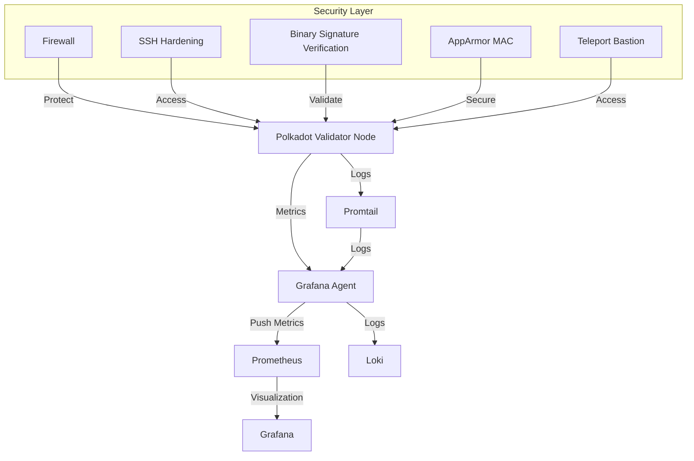
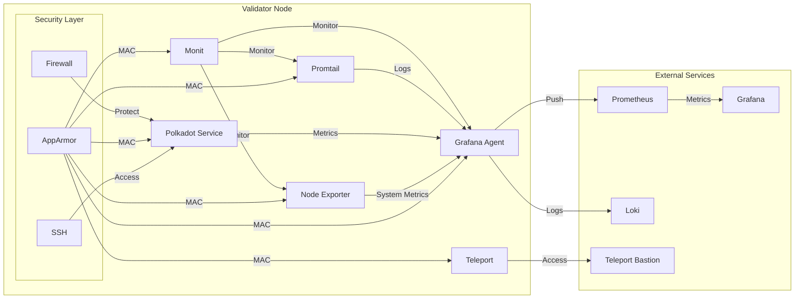

# Polkadot Validator Infrastructure Deployment

## Overview

This Ansible collection provides a comprehensive, secure, and automated solution for deploying and managing Polkadot validator nodes. Designed with a focus on security, observability, and reliability, the collection offers robust infrastructure-as-code capabilities.

## New Features

### Sync Type Validation
- Restricted sync types to 'warp', 'fast', and 'full'
- Validation added to ensure correct sync type usage

### Upgrade and Rollback Mechanism
- Comprehensive upgrade tasks with rollback strategy
- Backup and restore capabilities with notification system

### Monitoring and Backup Infrastructure
- Resource monitoring moved to admin role
- Flexible monitoring script with Slack and email notifications
- Integration with Grafana Agent for metrics

## Architecture



## Services Interaction



## Security and Hardening Features

### System Hardening
- **Shared Memory Protection**
  - Secure mounting of `/dev/shm`
  - Prevents code execution, setuid, and device access
  - Configurable mount options

- **Fail2ban SSH Protection**
  - Configurable brute-force attack mitigation
  - Customizable ban times and retry attempts
  - Multi-service support (SSH)

- **AppArmor Service Protection**
  - Mandatory Access Control (MAC) for all services
  - Fine-grained resource access control
  - Enforced security profiles
  - Protection against privilege escalation
  - Network and file system access restrictions

### Monitoring and Alerting
- Comprehensive system monitoring
- Centralized log management
- Proactive alerting
- **OpsGenie Heartbeats**
  - Configurable service health monitoring
  - Multiple heartbeat endpoints
  - Flexible interval settings

## Quick Configuration Examples

### Hardening Configuration
```yaml
hardening:
  shared_memory:
    enabled: true
    mount_options: 
      - noexec
      - nosuid
      - nodev
  
  fail2ban:
    enabled: true
    ssh:
      max_retry: 5
      ban_time: 7200  # 2 hours
      find_time: 1200  # 20 minutes
    services:
      - name: sshd
        enabled: true
```

### AppArmor Configuration
```yaml
apparmor:
  enabled: true  # Master switch for AppArmor
  profiles:
    grafana_agent:
      enabled: true   # Enable profile for Grafana Agent
      enforce: true   # Enforce mode (false for complain mode)
    node_exporter:
      enabled: true
      enforce: true
    promtail:
      enabled: true
      enforce: true
    monit:
      enabled: true
      enforce: true
    teleport:
      enabled: true
      enforce: true
```

### OpsGenie Heartbeat Configuration
```yaml
opsgenie:
  heartbeats:
    enabled: true
    api_key: "your_opsgenie_api_key"
    heartbeats:
      - name: node_health
        interval: 5  # minutes
        enabled: true
      - name: validator_status
        interval: 5  # minutes
        enabled: true
```

## Features

### 🔒 Security
- SSH hardening with best practices
- Firewall configuration 
- Binary signature verification
- Minimal privilege execution
- Secure service configurations
- AppArmor Mandatory Access Control
- Service-specific security profiles

### 🖥️ Monitoring
- Grafana Agent integration
- Monit service monitoring
- Node Exporter system metrics
- Promtail log aggregation

### 🚀 Validator Management
- Automated Polkadot binary deployment
- Systemd service management
- Version control
- Resource restriction
- Health checks

## Roles

### Admin Role
- System-level configurations
- Security hardening
- Monitoring stack setup
- User and group management

### Polkadot Role
- Validator node deployment
- Binary management
- Service configuration
- Monitoring integration

## Prerequisites

- Ansible 2.9+
- Ubuntu 20.04/22.04 LTS
- Python 3.8+
- pip3
- virtualenv
- git

## Installation

### Setup virtual environment and install dependencies
```bash
python3 -m venv venv
source venv/bin/activate
pip install molecule molecule-docker ansible ansible-lint
```

1. Install Ansible collections:
```bash
source venv/bin/activate
ansible-galaxy install -r requirements.yml
```

2. Configure your inventory and variables

## Configuration

Customize deployment through role variables in `group_vars` or `host_vars`:
- `polkadot_version`: Specify Polkadot binary version
- `validator_name`: Set your validator's name
- `monitoring_enabled`: Enable/disable monitoring components

## Testing

Uses Molecule for automated testing:
- Docker-based test environments
- Comprehensive role verification
- Scenario-based testing

## Security Considerations

- Regular updates to binary signatures
- Periodic security audits
- Minimal exposed ports
- Strict authentication mechanisms

## Usage
```bash
source venv/bin/activate
ansible-playbook --ask-become-pass -e user=$USER playbook.yaml
```

### Lifecycle Operations

The playbook supports different lifecycle operations for managing Polkadot validator nodes:

1. **Initial Setup**
   ```bash
   ansible-playbook playbook.yaml
   ```

2. **Blockchain Sync**
   ```bash
   ansible-playbook playbook.yaml -e "lifecycle.sync.enabled=true"
   ```

3. **Binary Upgrade**
   ```bash
   ansible-playbook playbook.yaml -e "lifecycle.upgrade.enabled=true"
   ```

4. **Maintenance**
   ```bash
   ansible-playbook playbook.yaml -e "lifecycle.maintenance.enabled=true"
   ```

5. **Health Checks**
   ```bash
   ansible-playbook playbook.yaml --tags health
   ```

Note: Lifecycle operations are mutually exclusive. When a lifecycle operation is active, the basic setup tasks will not run.

### Tags

The playbook supports various tags for targeted execution:

- `setup`: Run only setup tasks
- `lifecycle`: Run lifecycle management tasks
- `sync`: Run blockchain sync tasks
- `upgrade`: Run upgrade tasks
- `maintenance`: Run maintenance tasks
- `security`: Run security-related tasks
- `monitoring`: Run monitoring-related tasks
- `apparmor`: Run AppArmor configuration tasks

Example:
```bash
# Run only security-related tasks
ansible-playbook playbook.yaml --tags security

# Run setup and monitoring tasks
ansible-playbook playbook.yaml --tags "setup,monitoring"
```

## Contributing

1. Clone the repository
2. Create a feature branch
3. Commit your changes
4. Push and create a Pull Request

## License

Apache-2.0 License - See [LICENSE](LICENSE) file for details.

## Documentation

For detailed documentation on each role, please refer to:
- [Admin Role Documentation](roles/admin/README.md)
- [Polkadot Role Documentation](roles/polkadot/README.md)

## Contact

Maintained by the Polkadot Validator Infrastructure Team
