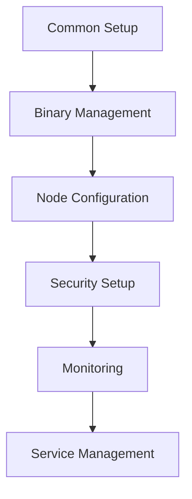

# Validator Ansible Collection

An Ansible collection for deploying and managing Polkadot validators. This collection provides a complete set of roles for setting up, configuring, and maintaining a Polkadot validator node.

## Architecture



## Roles

### System Setup
- **[Common Role](roles/common/README.md)**: Basic system setup and dependencies
  - Tags: `system`, `common`
  - Handles system packages, user setup, and basic configuration

### Binary Management
- **[Binaries Role](roles/binaries/README.md)**: Manages Polkadot binaries
  - Tags: `binaries`, `binaries-download`, `binaries-verify`
  - Downloads and verifies Polkadot binaries
  - Handles version management and rollbacks

### Node Configuration
- **[Node Config Role](roles/node_config/README.md)**: Configures validator settings
  - Tags: `config`, `node-config`
  - Sets up node configuration
  - Manages chain specifications and validator keys

### Security
- **[Security Role](roles/security/README.md)**: Implements security measures
  - Tags: `security`, `firewall`, `ssh`
  - Configures firewall rules
  - Hardens SSH access
  - Implements security best practices

### Monitoring
- **[Monitoring Role](roles/monitoring/README.md)**: Sets up monitoring stack
  - Tags: `monitoring`, `prometheus`, `grafana`
  - Installs and configures Prometheus
  - Sets up Grafana dashboards
  - Configures node metrics collection

## Quick Start

1. Install the collection:
```bash
ansible-galaxy collection install pampatzoglou.polkadot_validator
```

2. Create your inventory file:
```ini
[validators]
validator1 ansible_host=<your-server-ip>
```

3. Run the playbook:
```bash
# Full installation
ansible-playbook -i inventory site.yml

# Install specific components
ansible-playbook -i inventory site.yml --tags "binaries,monitoring"
```

## Tag Usage Examples

```bash
# Only update binaries
ansible-playbook -i inventory site.yml --tags binaries

# Update configuration and restart service
ansible-playbook -i inventory site.yml --tags "config,service"

# Update monitoring stack
ansible-playbook -i inventory site.yml --tags monitoring

# Verify installation
ansible-playbook -i inventory site.yml --tags verify
```

## Pre-commit Hooks

Pre-commit hooks are used to ensure code quality and consistency. This project includes pre-commit hooks for YAML linting, Ansible linting, and Python formatting.

### Installation

1. Install pre-commit:

```bash
pip install pre-commit
```

2. Install the pre-commit hooks:

```bash
pre-commit install
```

### Usage

Pre-commit hooks will automatically run on `git commit`. You can also manually run all hooks on all files:

```bash
pre-commit run --all-files
```

## Testing with Molecule

Molecule is used to test the roles in this collection to ensure they work as expected. Follow the steps below to set up and run tests.

### Requirements

- Python 3.8 or higher
- Ansible 2.9 or higher
- Docker (for running tests in containers)
- Molecule and its plugins

### Installation

First, create a Python virtual environment and activate it:

```bash
apt install -y python3-venv
python3 -m venv venv
source venv/bin/activate
```

Then, install Molecule, Ansible, and their necessary plugins:

```bash
pip install molecule molecule-docker ansible ansible-lint
```

### Running Tests

You can run molecule tests for all roles directly from the project root:

```bash
# Test all roles
molecule test --all

# Test a specific role
molecule test -s role_name
```

For example, to test the security role:
```bash
molecule test -s security
```

This command will:
1. Create a Docker container based on the scenario configuration.
2. Apply the role to the container.
3. Run any defined tests.
4. Destroy the container after tests are complete.

### Customizing Tests

You can customize the test scenarios by editing the `molecule.yml` file in the role's `molecule` directory. This file defines the test environment and any specific tests to run.

For more information on Molecule, refer to the [Molecule documentation](https://molecule.readthedocs.io/).

## Requirements

- Ansible 2.9 or higher
- Ubuntu 20.04 or higher / Debian 11 or higher
- Python 3.8 or higher

## Contributing

Please read our [Contributing Guidelines](CONTRIBUTING.md) before submitting pull requests.

## License

This project is licensed under the MIT License - see the [LICENSE](LICENSE) file for details.

## Documentation

For detailed documentation on each role, please refer to the README files in their respective directories:

- [Common Role Documentation](roles/common/README.md)
- [Binaries Role Documentation](roles/binaries/README.md)
- [Node Config Role Documentation](roles/node_config/README.md)
- [Security Role Documentation](roles/security/README.md)
- [Monitoring Role Documentation](roles/monitoring/README.md)
- [Service Role Documentation](roles/service/README.md)