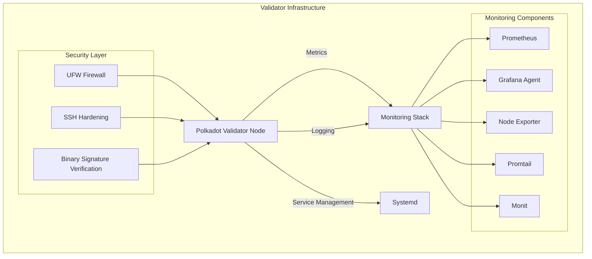
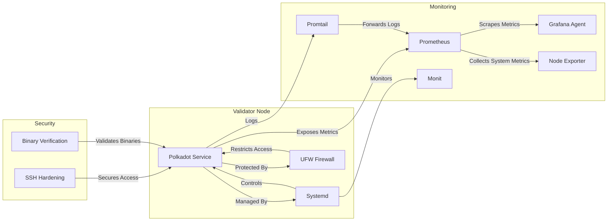

# Polkadot Validator Infrastructure Deployment

## Overview

This Ansible collection provides a comprehensive, secure, and automated solution for deploying and managing Polkadot validator nodes. Designed with a focus on security, observability, and reliability, the collection offers robust infrastructure-as-code capabilities.

## Architecture



## Services Interaction



## Features

### 🔒 Security
- SSH hardening with best practices
- Firewall configuration (UFW)
- Binary signature verification
- Minimal privilege execution
- Secure service configurations

### 🖥️ Monitoring
- Prometheus metrics collection
- Grafana Agent integration
- Monit service monitoring
- Node Exporter system metrics
- Promtail log aggregation

### 🚀 Validator Management
- Automated Polkadot binary deployment
- Systemd service management
- Version control
- Resource restriction
- Health checks

## Roles

### Admin Role
- System-level configurations
- Security hardening
- Monitoring stack setup
- User and group management

### Polkadot Role
- Validator node deployment
- Binary management
- Service configuration
- Monitoring integration

## Prerequisites

- Ansible 2.12+
- Python 3.8+
- Ubuntu/Debian 20.04+

## Installation

1. Install Ansible collections:
```bash
ansible-galaxy install -r requirements.yml
```

2. Configure your inventory and variables

## Configuration

Customize deployment through role variables in `group_vars` or `host_vars`:

- `polkadot_version`: Specify Polkadot binary version
- `validator_name`: Set your validator's name
- `monitoring_enabled`: Enable/disable monitoring components

## Testing

Uses Molecule for automated testing:
- Docker-based test environments
- Comprehensive role verification
- Scenario-based testing

## Security Considerations

- Regular updates to binary signatures
- Periodic security audits
- Minimal exposed ports
- Strict authentication mechanisms

## Contributing

1. Fork the repository
2. Create a feature branch
3. Commit your changes
4. Push and create a Pull Request

## License

MIT License - See [LICENSE](LICENSE) file for details.

## Documentation

For detailed documentation on each role, please refer to:
- [Admin Role Documentation](roles/admin/README.md)
- [Polkadot Role Documentation](roles/polkadot/README.md)

## Contact

Maintained by the Polkadot Validator Infrastructure Team
