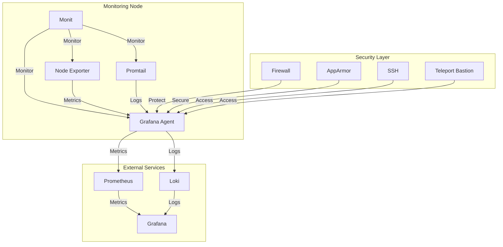
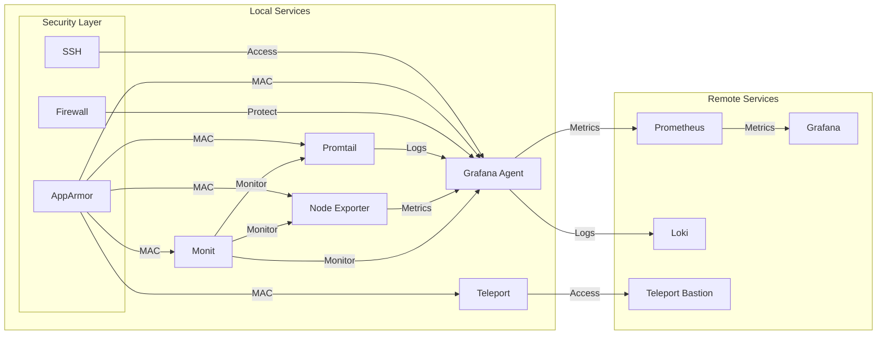

# Admin Role: System Hardening and Configuration

This role manages system administration tasks, monitoring, and secure access for validator nodes, with a focus on hardening and configuration.

## New Features

### Resource Monitoring
- Comprehensive resource monitoring with configurable thresholds
- Alerts via Slack and email
- Integration with Grafana Agent for detailed metrics

## Features

- UFW firewall configuration
- Monit system monitoring
- Grafana Agent for metrics collection
- Promtail for log aggregation
- Node Exporter for system metrics
- Teleport for secure SSH access
- Binary signature verification
- OpsGenie heartbeats for service health monitoring

### 🔒 Security Hardening
#### AppArmor Service Protection
- Mandatory Access Control (MAC) for all services
- Fine-grained resource access control
- Enforced security profiles for each service
- Protection against privilege escalation
- Network access control per service
- File system access restrictions

#### Shared Memory Protection
- Secure mounting of `/dev/shm`
- Prevents code execution in shared memory
- Configurable security options

#### SSH Protection with Fail2ban
- Brute-force attack mitigation
- Customizable ban times and retry limits
- Multi-service SSH protection

### 🛡️ Configuration Options

#### Shared Memory Hardening
```yaml
hardening:
  shared_memory:
    enabled: true  # Enable/disable
    mount_options: 
      - noexec     # Prevent code execution
      - nosuid     # Prevent setuid binaries
      - nodev      # Prevent device files
```

#### Fail2ban Configuration
```yaml
hardening:
  fail2ban:
    enabled: true  # Enable/disable Fail2ban
    ssh:
      max_retry: 5     # Allowed login attempts
      ban_time: 7200   # Ban duration (seconds)
      find_time: 1200  # Time window for retry attempts
    services:
      - name: sshd
        enabled: true
      - name: ssh
        enabled: false
```

#### OpsGenie Heartbeat Configuration
```yaml
opsgenie:
  heartbeats:
    enabled: true  # Enable/disable OpsGenie integration
    api_key: "your_opsgenie_api_key"
    heartbeats:
      - name: node_health
        interval: 5     # Heartbeat interval (minutes)
        enabled: true
      - name: validator_status
        interval: 5
        enabled: true
```

#### AppArmor Configuration
```yaml
apparmor:
  enabled: true  # Master switch for AppArmor
  profiles:
    grafana_agent:
      enabled: true   # Enable profile for Grafana Agent
      enforce: true   # Enforce mode (false for complain mode)
    node_exporter:
      enabled: true
      enforce: true
    promtail:
      enabled: true
      enforce: true
    monit:
      enabled: true
      enforce: true
    teleport:
      enabled: true
      enforce: true
```

## Requirements

- Ansible 2.9+
- Ubuntu 20.04+ / Debian 11+
- Python 3.8+

## Role Variables

### UFW Configuration
```yaml
ufw:
  enabled: true
  default_incoming_policy: "deny"
  default_outgoing_policy: "allow"
  rules:
    - { port: 22, proto: "tcp", rule: "allow" }
    - { port: 3022, proto: "tcp", rule: "allow" }
```

### Monit Configuration
```yaml
monit:
  enabled: true
  config_dir: "/etc/monit"
  config_file: "/etc/monit/monitrc"
  include_dir: "/etc/monit/conf.d"
  check_interval: 30
  start_delay: 120
```

### Promtail Configuration
```yaml
promtail:
  version: "2.9.2"
  enabled: true
  install_dir: "/usr/local/bin"
  config_dir: "/etc/promtail"
  positions_dir: "/var/lib/promtail"
  loki_url: "http://loki:3100/loki/api/v1/push"
```

### Grafana Agent Configuration
```yaml
grafana_agent:
  version: "0.39.1"
  enabled: true
  remote_write:
    - url: "http://prometheus:9090/api/v1/write"
```

### Node Exporter Configuration
```yaml
node_exporter:
  version: "1.7.0"
  enabled: true
  port: 9100
```

### Teleport Configuration
```yaml
teleport:
  enabled: true
  version: "13.3.2"
  auth_token: ""  # Required
  auth_server: "" # Required
```

### Hardening Configuration
```yaml
hardening:
  shared_memory:
    enabled: true  # Enable/disable
    mount_options: 
      - noexec     # Prevent code execution
      - nosuid     # Prevent setuid binaries
      - nodev      # Prevent device files
  fail2ban:
    enabled: true  # Enable/disable Fail2ban
    ssh:
      max_retry: 5     # Allowed login attempts
      ban_time: 7200   # Ban duration (seconds)
      find_time: 1200  # Time window for retry attempts
    services:
      - name: sshd
        enabled: true
      - name: ssh
        enabled: false
```

### OpsGenie Heartbeat Configuration
```yaml
opsgenie:
  heartbeats:
    enabled: true  # Enable/disable OpsGenie integration
    api_key: "your_opsgenie_api_key"
    heartbeats:
      - name: node_health
        interval: 5     # Heartbeat interval (minutes)
        enabled: true
      - name: validator_status
        interval: 5
        enabled: true
```

## Architecture



## Services Interaction



## Dependencies

Required Ansible collections:
- community.general
- ansible.posix

## Example Playbook

```yaml
- hosts: validators
  roles:
    - role: admin
      vars:
        teleport:
          auth_token: "your-auth-token"
          auth_server: "auth.example.com:3025"
        monit:
          checks:
            system:
              enabled: true
        promtail:
          enabled: true
          loki_url: "http://loki.example.com:3100"
        hardening:
          shared_memory:
            enabled: true
          fail2ban:
            enabled: true
            ssh:
              max_retry: 5
        opsgenie:
          heartbeats:
            enabled: true
            api_key: "your_opsgenie_api_key"
            heartbeats:
              - name: node_health
                interval: 5
                enabled: true
              - name: validator_status
                interval: 5
                enabled: true
        apparmor:
          enabled: true
          profiles:
            grafana_agent:
              enabled: true
              enforce: true
            node_exporter:
              enabled: true
              enforce: true
            promtail:
              enabled: true
              enforce: true
            monit:
              enabled: true
              enforce: true
            teleport:
              enabled: true
              enforce: true
```

## Security Features

- Binary signature verification for all downloaded binaries
- UFW firewall with restrictive default policies
- Secure service configurations with minimal privileges
- Dedicated system users for each service
- Systemd service hardening
- Shared memory protection
- SSH protection with Fail2ban
- AppArmor service protection

## Monitoring Stack

### Monit
- System resource monitoring
- Process monitoring
- Custom service checks

### Grafana Agent
- Metrics collection
- Remote write to Prometheus
- Service discovery

### Promtail
- Log aggregation
- Label management
- Loki integration

### Node Exporter
- System metrics collection
- Hardware monitoring
- Resource utilization tracking

### OpsGenie Heartbeats
- Configurable service health monitoring
- Multiple heartbeat endpoints
- Flexible interval settings
- Systemd-managed heartbeat services

## Testing

This role includes Molecule tests for verifying functionality:

```bash
# Install test dependencies
pip install molecule molecule-docker ansible-lint

# Run tests
cd roles/admin
molecule test
```

The tests verify:
- Package installation
- Service configuration
- Port availability
- Binary installation
- Configuration files
- System users
- UFW rules

## License

Apache-2.0

## Author Information

Created by [Your Name]
