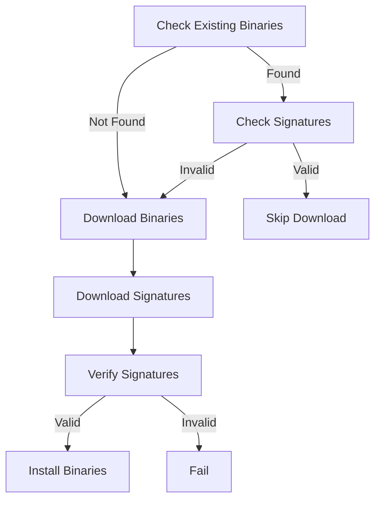

```
# Polkadot Role

This Ansible role downloads and installs Polkadot binaries from the official Polkadot-SDK releases. It handles downloading the binaries, verifying their SHA256 checksums and GPG signatures, and installing them in versioned directories with symlinks for easy rollback.

## Architecture



## Requirements

- Ansible 2.9 or higher
- Access to the internet to download binaries
- `gnupg` package (will be installed by the role)
- `sha256sum` command (usually pre-installed on Linux systems)

## Role Variables

The following variables are available for customization (defaults shown):

```yaml
# Polkadot version (using the stable release format)
polkadot_version: "stable2409-2"

# Base URL for downloads
polkadot_base_url: "https://github.com/paritytech/polkadot-sdk/releases/download"

# Binary installation directory
binary_base_dir: "/usr/local/bin"

# Keep previous versions
keep_previous_versions: 2

# Cleanup old versions
cleanup_old_versions: true

# Wait time before cleanup (seconds)
cleanup_wait_time: 300
```

## Binary Management Process

1. **Version Check**

   - The role first checks if the requested version is already installed
   - Verifies the existence of binary files and their signatures
2. **Signature Verification**

   - For existing binaries, GPG signatures are verified
   - If verification fails, binaries are re-downloaded
3. **Download Process**

   - Downloads only occur for missing or invalid binaries
   - Downloads include:
     * Binary files
     * SHA256 checksums
     * GPG signatures
4. **Installation**

   - Binaries are installed in versioned directories
   - Symlinks are created for easy access
   - Old versions are managed based on configuration

## Usage

Include this role in your playbook:

```yaml
- hosts: validators
  roles:
    - role: binaries
      vars:
        polkadot_version: "stable2409-2"
```

## Version Management

The role supports keeping multiple versions installed:

```mermaid
graph LR
    A[/usr/local/bin] --> B[stable2409-2]
    A --> C[stable2409-1]
    B --> D[polkadot]
    B --> E[polkadot-prepare-worker]
    C --> F[polkadot]
    C --> G[polkadot-prepare-worker]
```

## Security

- All binaries are verified using both SHA256 checksums and GPG signatures
- Downloads are performed over HTTPS
- Binary versions are isolated in separate directories
- Rollback capability through version management

```

```
