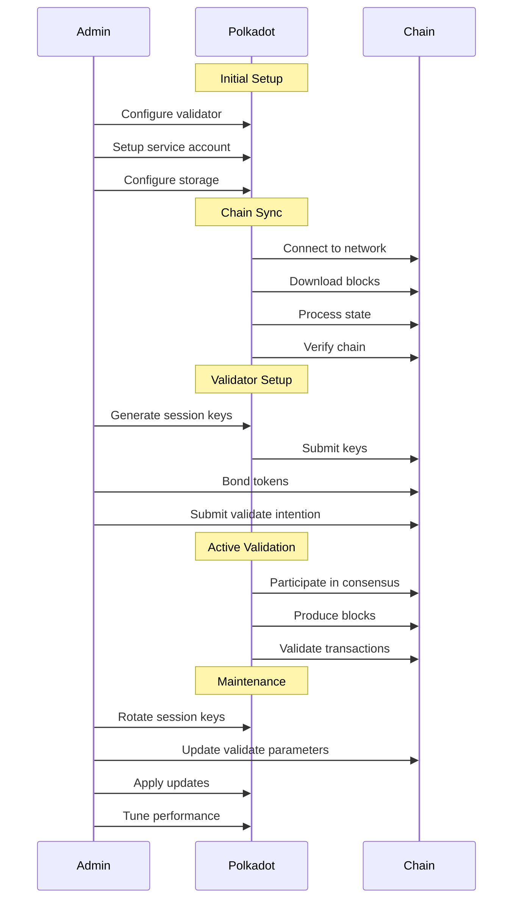

# Polkadot Validator Role

This role installs and configures a Polkadot validator node with security best practices and monitoring integration.

## Architecture


## Validator Lifecycle Sequence



## New Features

### Lifecycle Management
- Enhanced lifecycle management with sync, upgrade, and maintenance phases
- Comprehensive rollback mechanism for upgrades

### Backup Capabilities
- Automated backup and restore procedures
- Configurable retention policies and storage options

## Features

- Secure systemd service configuration
- Binary management with signature verification
- Firewall configuration
- Monit service monitoring
- Dedicated system user and group
- Directory structure management
- Prometheus metrics exposure
- AppArmor service protection
- Lifecycle management (sync, upgrade, maintenance)

## Requirements

- Ansible 2.9+
- Ubuntu 20.04+ / Debian 11+
- Python 3.8+
- Minimum 16GB RAM
- Minimum 500GB SSD storage

## Role Variables

### Binary Configuration
```yaml
polkadot_version: "1.3.0"
polkadot_binary_url: "https://github.com/paritytech/polkadot/releases/download/v{{ polkadot_version }}/polkadot"
polkadot_binary_signature_url: "{{ polkadot_binary_url }}.asc"
polkadot_binary_path: "/usr/local/bin/polkadot"
```

### Service Configuration
```yaml
polkadot_service_enabled: true
polkadot_service_state: "started"
polkadot_user: "polkadot"
polkadot_group: "polkadot"
```

### Directory Configuration
```yaml
polkadot_dirs:
  - "/data/polkadot"
  - "/var/run/polkadot"
  - "/var/log/polkadot"
  - "/home/polkadot/.local/share/polkadot"
```

### Node Configuration
```yaml
polkadot_node_name: "validator-1"
polkadot_chain: "polkadot"
polkadot_validator_mode: true
polkadot_telemetry_enabled: false
```

### Lifecycle Management
```yaml
lifecycle:
  sync:
    enabled: false    # Enable blockchain sync phase
  upgrade:
    enabled: false    # Enable binary upgrade phase
  maintenance:
    enabled: false    # Enable maintenance phase
  rollback:
    enabled: false    # Enable rollback mechanism for upgrades
```

### Backup Capabilities
```yaml
backup:
  enabled: false      # Enable automated backup and restore procedures
  retention_policy:   # Configurable retention policy (e.g., daily, weekly, monthly)
  storage_options:    # Configurable storage options (e.g., local, S3, GCS)
```

### AppArmor Configuration
```yaml
apparmor:
  enabled: true
  profiles:
    polkadot:
      enabled: true    # Enable AppArmor profile for Polkadot
      enforce: true    # Set to enforce mode (false for complain mode)
```

## Dependencies

Required Ansible collections:
- community.general
- ansible.posix

## Example Playbook

```yaml
- hosts: validators
  roles:
    - role: polkadot
      vars:
        polkadot_node_name: "validator-1"
        polkadot_validator_mode: true
        polkadot_telemetry_enabled: false
```

## Usage

### Basic Installation
```bash
# Run basic installation and setup
ansible-playbook playbook.yaml
```

### Lifecycle Operations

The role supports different lifecycle operations that can be triggered via command-line parameters:

1. **Sync Operation**
   ```bash
   # Trigger blockchain sync
   ansible-playbook playbook.yaml -e "lifecycle.sync.enabled=true"
   ```

2. **Upgrade Operation**
   ```bash
   # Perform binary upgrade
   ansible-playbook playbook.yaml -e "lifecycle.upgrade.enabled=true"
   ```

3. **Maintenance Operation**
   ```bash
   # Run maintenance tasks
   ansible-playbook playbook.yaml -e "lifecycle.maintenance.enabled=true"
   ```

4. **Rollback Operation**
   ```bash
   # Trigger rollback mechanism for upgrades
   ansible-playbook playbook.yaml -e "lifecycle.rollback.enabled=true"
   ```

Note: Lifecycle operations are mutually exclusive. When a lifecycle operation is active, the basic setup tasks will not run.

## Security Features

- Dedicated system user with minimal privileges
- Systemd service hardening:
  * PrivateTmp=true
  * NoNewPrivileges=true
  * ProtectSystem=strict
  * ProtectHome=true
  * ReadWritePaths restrictions
- Firewall with restrictive rules
- Binary signature verification
- AppArmor Mandatory Access Control:
  * Fine-grained resource access control
  * Network access restrictions
  * File system access limitations
  * Protection against privilege escalation

## Directory Structure

```
/data/polkadot/
├── config.json         # Node configuration
└── chain-data/         # Blockchain data

/var/run/polkadot/
└── polkadot.pid       # Process ID file

/var/log/polkadot/
└── polkadot.log       # Service logs

/home/polkadot/.local/share/polkadot/
├── chains/            # Chain-specific data
└── keystore/          # Node keys
```

## Service Management

The role configures a systemd service with:
- Automatic restart on failure
- Resource limits
- Security restrictions
- Proper logging

## Monitoring Integration

### Prometheus Metrics
- Exposed on port 9615
- Node-specific metrics
- Validator performance metrics
- System resource usage

### Monit Checks
- Process monitoring
- Resource usage alerts
- Custom validator checks

## Testing

This role includes Molecule tests:

```bash
# Install test dependencies
pip install molecule molecule-docker ansible-lint

# Run tests
cd roles/polkadot
molecule test
```

The tests verify:
- Binary installation
- Service configuration
- Directory permissions
- Port availability
- User/group creation
- Monitoring integration

## License

Apache-2.0

## Author Information

Created by [Your Name]
